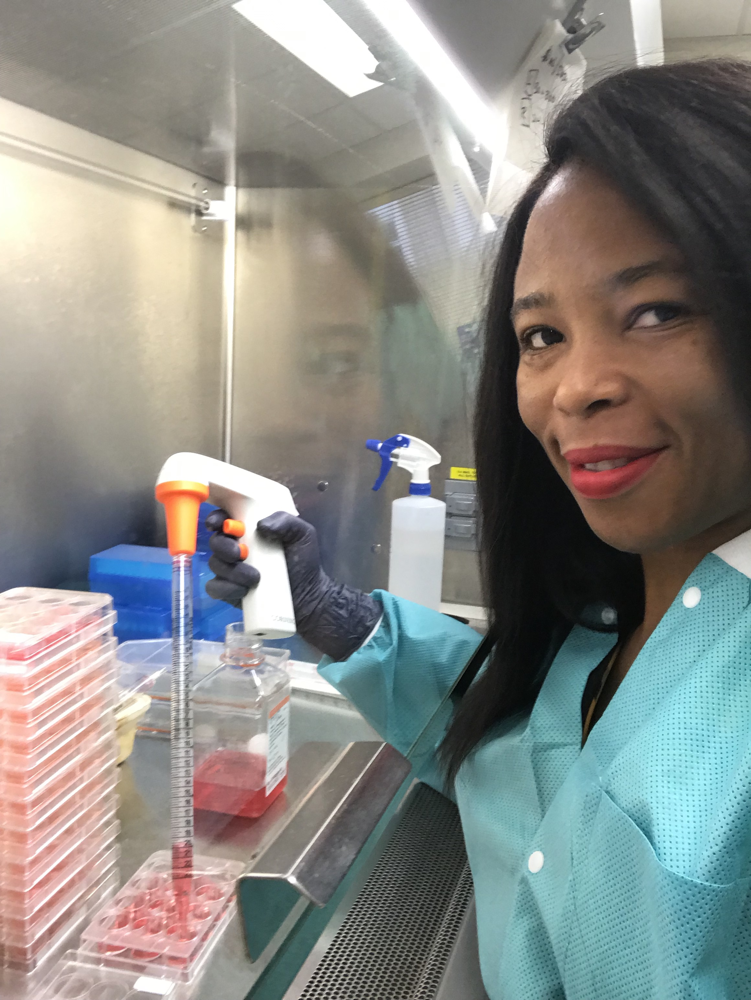

<link rel="stylesheet" href="styles.css" type="text/css">

I currently hold a masters of science degree in Biostatistics and Data Science from Cornell University. Prior to my masters degree, I graduated magna cum laude with a Bachelor of Science degree in Biological Sciences with honors and a Bachelor of Arts degree in Mathematics-Economics with honors and distinction from the University at Buffalo. I have over two years of work experience in virology research at the Galveston National Laboratory where I worked on different scientific research projects. 
 
Current Work:
I founded the Biosafety Management Company and we provide consultancy services to state governments in Nigeria to enhance their COVID-19 response. Some of our projects include setting up infectious diseases laboratories and providing biosafety training to laboratory personnel. 