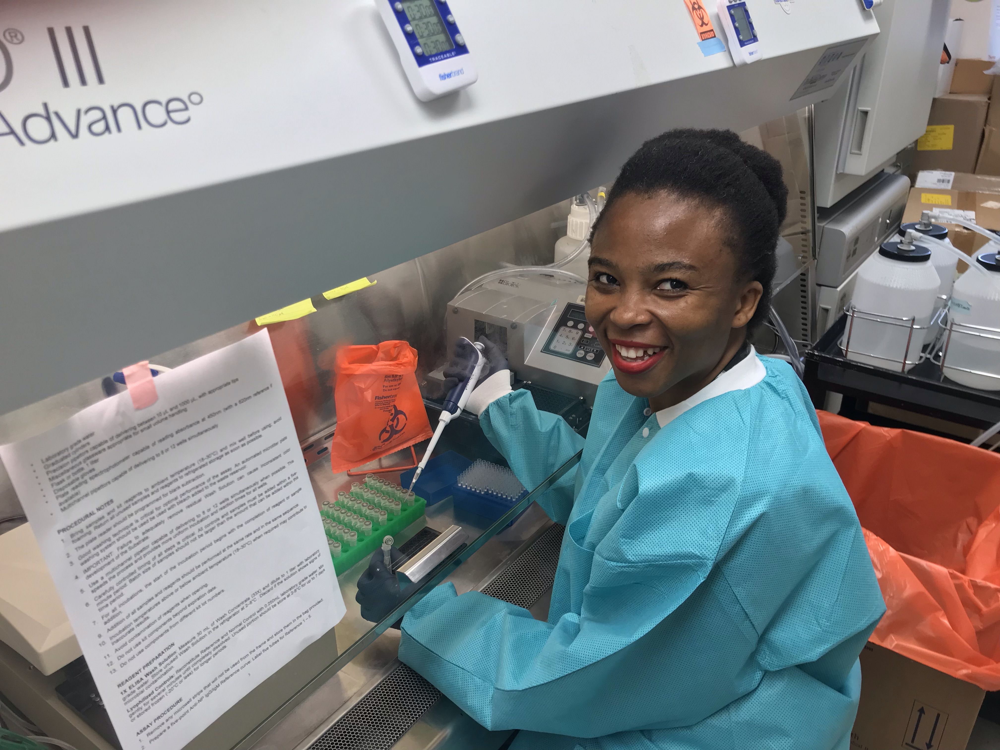

Aspiring Data Scientist

---

---

<link rel="stylesheet" href="styles.css" type="text/css">

I am an aspiring biostatistician/ data scientist / analyst who is passionate about infectious diseases research. I am particularly interested in highly pathogenic viruses like Lassa, Ebola and their mechanisms of cellular damage in organ systems like the brain. I am currently pursuing a masters degree in Biostatistics and Data Science at the Health Policy and Research Department [Health Policy and Research Department](https://hpr.weill.cornell.edu) of the Weill Cornell Medical College  in the department of Epidemiology & Biostatistics. 

For my undergraduate studies, I studied biological sciences, mathematics and economics at the [University at Buffalo](http://www.buffalo.edu). I then worked at the Galveston National Laboratory at the [University of Texas Medical Branch](https://www.utmb.edu) for two years where I conducted research on the following viruses: Lassa virus, Junin virus, Zika virus, Influenza virus, as well as HIV.  

The shinyapps I have developed collaboratively and individually can be found [here](https://chiomahezeomah.shinyapps.io). 

My full CV is available [here](EzeomahChiomahCVOct25_2019.pdf).