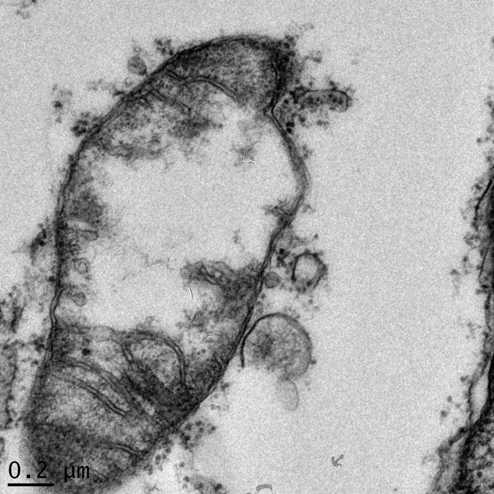

I have been involved with a few translational research projects. Below is a brief list of some of my research projects and the mentors I worked under: 

[Prof. David Walker M.D.](https://researchexperts.utmb.edu/en/persons/david-walker)

1.	Sequelae of Lassa Fever - Post Viral Cerebellar Ataxia (Review paper submitted to scientific journal for peer review):  Authors - Chiomah Ezeomah, Adeyi Adoga, Chikwe Ihekweazu, Slobodan Paessler, Irma Cisneros, Oyewale Tomori, David Walker.

2.	Case-Control Study of the Association of Lassa virus exposure and hearing loss: Performed a case-controlled study to investigate the association between Lassa virus infection and hearing loss in patients with partial or complete hearing impairment at the Jos University Teaching Hospital (JUTH). Faculty Sponsor: Prof. David Walker; Nigerian supervising authors: Prof. Oyewale Tomori, Prof. Adeyi Adoga (Head of the Otorhinolaryngology Department at JUTH).

[Dr. Irma Cisneros](https://www.utmb.edu/pathology/faculty-directory/irma-lisa-cisneros-phd)

3.	Fentanyl Self-Administration Impacts Brain-Specific Immune Responses in Male Sprague-Dawley Rats: Was responsible for RNA extraction, cDNA preparation, protein extraction and quantification, gene expression assays using quantitative real-time polymerase chain reaction technology, western blot assays. Helped with data analysis and manuscript preparation.

4.	Characterizing the Effects of Cocaine on Mitochondrial Antiviral Signaling Protein (MAVS) and Stimulator of Interferon Genes (STING) in HIV transgenic rats (Manuscript being Prepared): Was responsible for the gene expression assays using quantitative polymerase chain reaction (qPCR) technology and western blot assays including RNA extraction, cDNA preparation, protein extraction and quantification, in addition to data analysis.

[Prof. Slobodan Paessler](https://www.utmb.edu/pathology/faculty-directory/slobodan-paessler-dvm-phd)

5.	The glycoprotein of the live-attenuated Junin virus vaccine strain induces ER stress and forms aggregates prior to degradation in the lysosome (submitted for peer review): Helped in a study to characterize the vaccine GPC (Candid vaccine) in order to link removal of N-Linked glycans to attenuation. Authors: John Manning, Nadya Yun, Alexey Seregin, Takaaki Koma, Rachel Sattler, Chiomah Ezeomah, Cheng Huang, Juan de la Torre, and Slobodan Paessler

